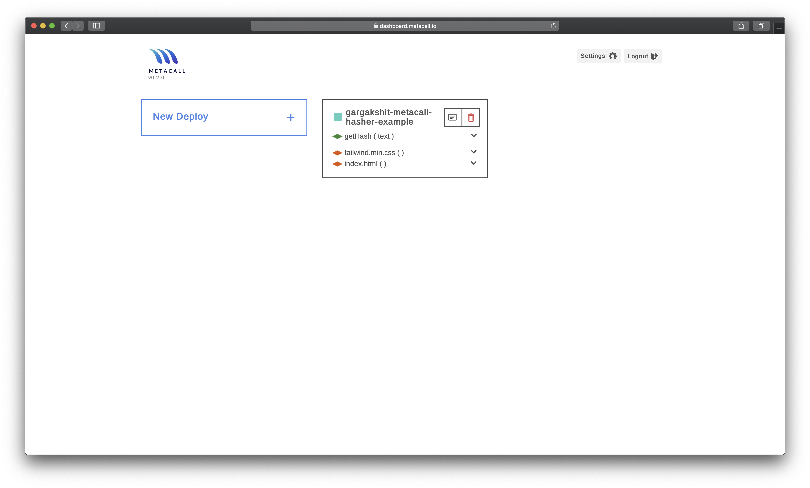
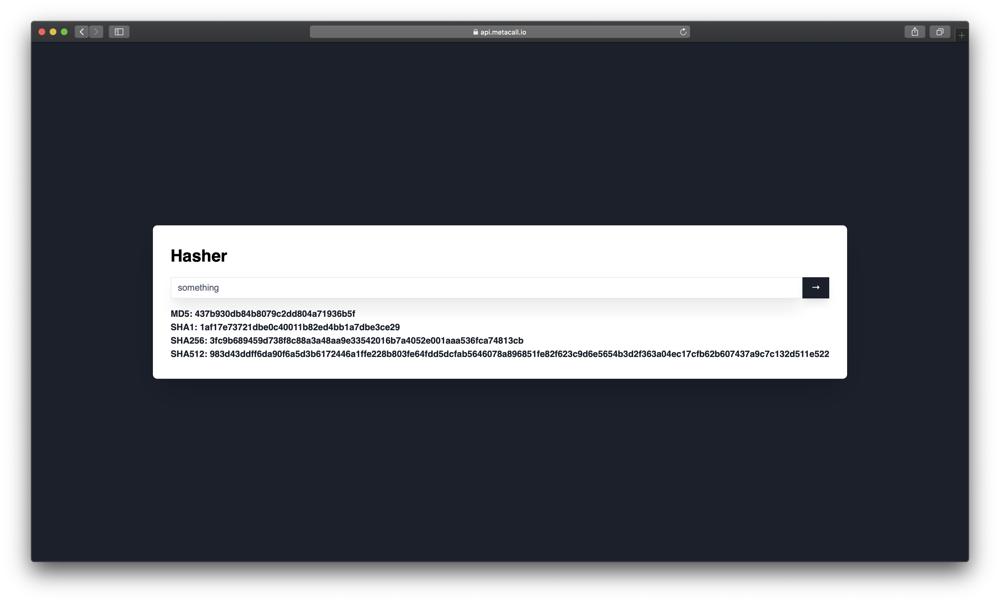

# Create a hashing function using the Metacall FaaS

In this example we show how to use the Metacall FaaS to deploy a node function to hash some text and a frontend for the same

---

Metacall FaaS

After deploying the application into the FaaS [https://dashboard.metacall.io](https://dashboard.metacall.io), it can be accessed with (change <your_alias> by the alias you used to sign up):

`curl -X POST https://api.metacall.io/<your_alias>/metacall-beautifulsoup-express-example/v1/call/getHash -X POST --data '{ "text": "something" }'`

or visit

https://api.metacall.io/<your_alias>metacall-beautifulsoup-express-example/v1/static/index.html

---

# Preview

